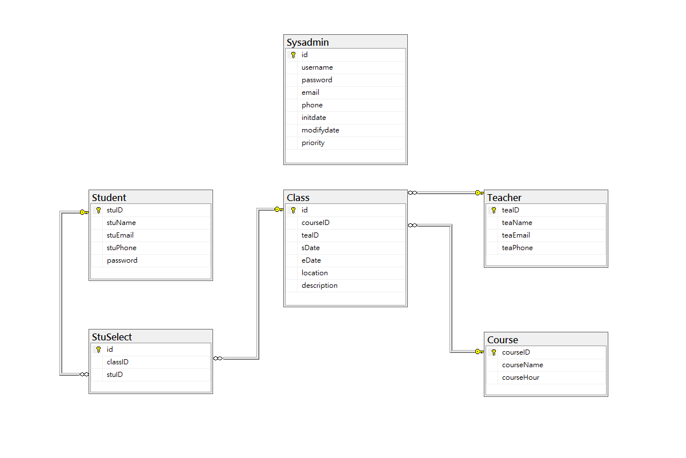
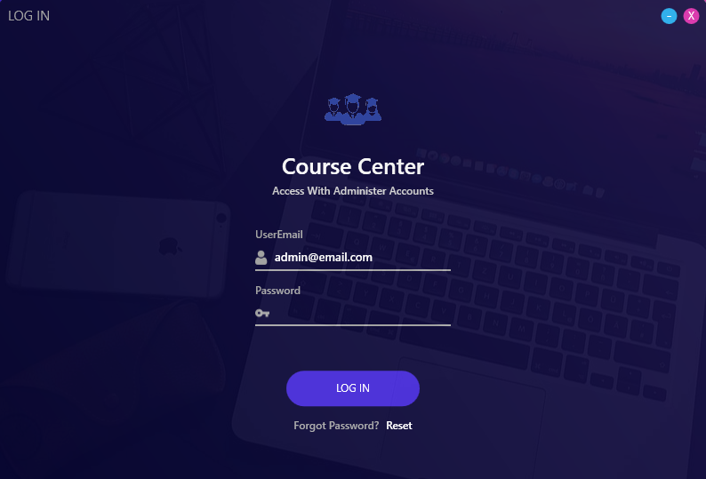
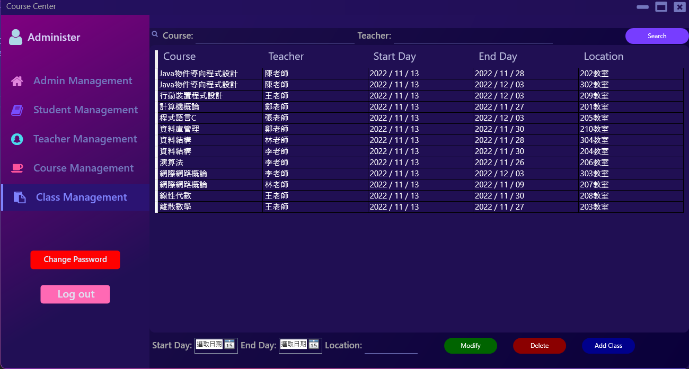
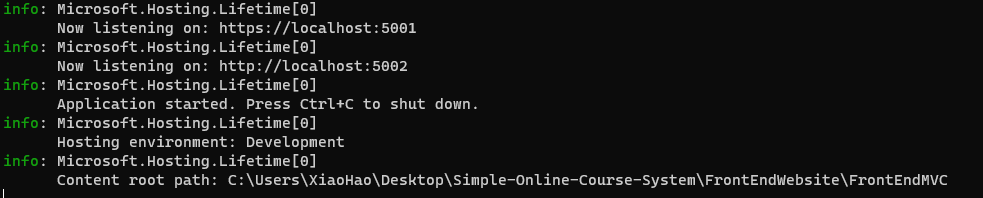
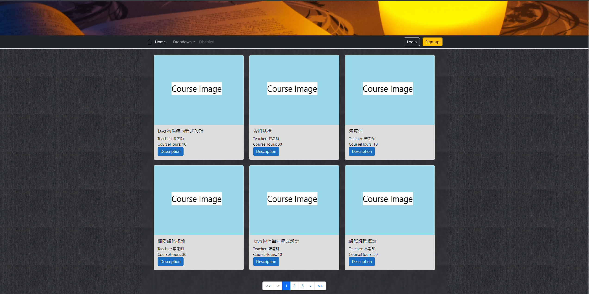
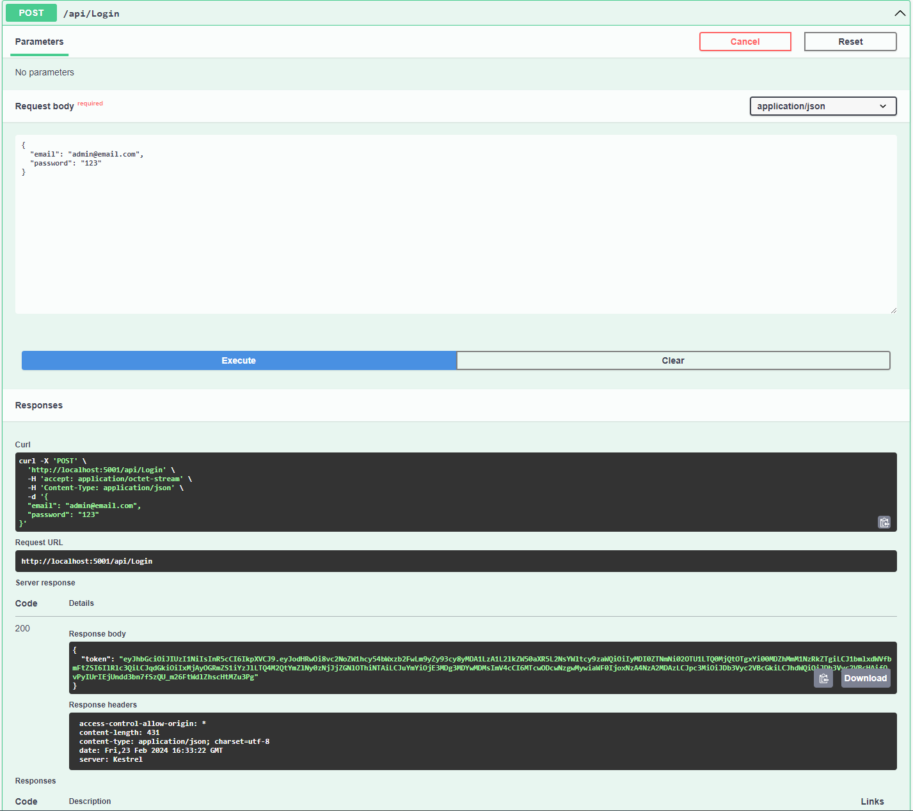

# Simple Online Course System
Simulating an Online-Course system which people can purchase on website.  

**Environment**
- .Net framework WPF
- Asp.net Core MVC / Web Api
- Microsoft SQL Server

**Required skills**
- Html, CSS, Javascript, Bootstrap
- C#, Dependency Injection
- JWT Bearer Token
- T-SQL database manipulation, Ado.net
- Entity Framework (ORM)

**Reference**
- [RJ Code UI design](https://www.youtube.com/watch?v=pZGcRHgmn8k)

## Catalog
- [Repo Structure](#repo-structure)
- [Database Structure](#database-structure)
- [BackEndManager](#backendmanager)
- [FrontEndWebsite](#frontendwebsite)
- [Api](#api)


## Repo Structure
```
Simple-Online-Course-System/webapps\webroot\WEB-INF\reportlets
├── FrontEndWebsite (Asp.net Core 3.1 MVC)
├── BackEndManager (.Net framework 4.8 WPF)
├── Api (Asp.net Core 3.1 Web Api)
└── DatabaseBackup (SQL Server)
```

The whole system consists of 4 parts:  

1. `FrontEndWebsite`: Users can browse the website through a web browser to view currently available courses, register an account, log in as a member, and add courses to the shopping cart.

2. `BackEndManager`: System administrators can manage student data and configure course offerings through a desktop application.

3. `Api`: Providing APIs for other front-end applications to integrate, achieving the same functionality as the MVC project website.

4. `DatabaseBackup`: Data is stored in a database for storage, and it contains a backup file to import to database.

## Database Structure



## BackEndManager
#### **The WPF Application is refered from `RJ Code`**

check out his works  
Youtube 👉 [WPF UI/ Design a Modern Login Form/ Introducing to WPF](https://www.youtube.com/watch?v=pZGcRHgmn8k)  
Website 👉 [DOWNLOAD PROJECT](https://rjcodeadvance.com/crear-formulario-de-inicio-de-sesion-moderno-con-wpf/)


 There're sets of testing data in `Simple-Online-Course-System/DatabaseBackup/TainanNet.bak`  
 Just restore it to SQL Server.

 Please use `Visual Studio` to open `Simple-Online-Course-System/BackEndManager/BackEndManager.sln`, 
 then start running.

 UserEmail: `admin@email.com`  
 Password: `123`  



To create classes that users from website can browse and select, you need to follow the steps:

1. Go to `Teacher Management` : Create teachers' profile
2. Go to `Course Management` : Create Courses which define learning hours in a semester
3. Go to `Class Management` : Choose teachers and courses to create a class

Finally you would get the view bellow.
There're already couples of classes in backup, you can add additional one for yourself.




## FrontEndWebsite

Go to `Simple-Online-Course-System/FrontEndWebsite/FrontEndMVC`

Build and run the Asp.net MVC project to operate a website
``` powershell
cd Simple-Online-Course-System/FrontEndWebsite/FrontEndMVC
dotnet run

```

if it succeeded, the prompt would be like this


Go to browser and request `https://localhost:5001`



The main section shows the classes you just created!  
Check out the demonstration video 👇👇👇  
[](https://drive.google.com/file/d/12zTnMommy4Zy2i98V2B0CJsSL4kD8LgM/view?usp=sharing)

## Api
The FrontEndWebsite(Asp.net MVC) is server side rendering by using `Razor` to display screen while I provided a web api to let front-end developer access this system.

``` powershell
cd Simple-Online-Course-System/Api/CourseApi
dotnet run

```

When running the Api, go to `Swagger` to test data manipulation.
```
http://localhost:5001/swagger
```

Url: `http://localhost:5001/api/Login`  
Method: `POST`  
Json Content 👇  
``` Json
{
  "email": "admin@email.com",
  "password": "123"
}
```

If login is successful, it will return `JWT Token`



Now, give it a try!

```
http://localhost:5001/api/Course
```

The advantage of using Web APIs is that it enables a separation of the front-end and back-end systems. By integrating with APIs and consuming JSON strings, front-end applications on various devices and developed with different programming languages can achieve the same functionality.